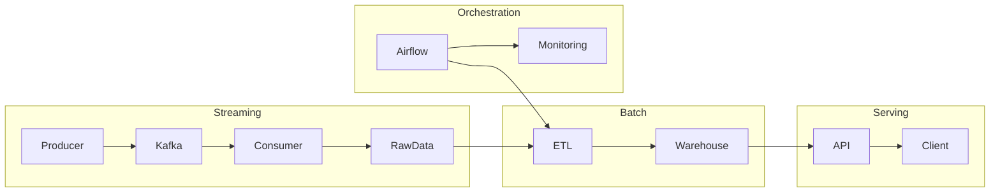

# 🏗 End-to-End Data Engineering Platform


A production-style end-to-end data engineering platform that integrates batch processing, real-time streaming, API serving, and workflow orchestration into a unified system.
This platform demonstrates how modern data systems handle both batch and real-time workloads in a scalable and maintainable way.

---

# 🧠 System Overview

This platform simulates a **modern data engineering architecture** used in real-world systems.
This architecture separates concerns across different layers to improve scalability, maintainability, and reliability.

It consists of four main layers:

- Batch Processing Layer (ETL)
- Serving Layer (Analytics API)
- Streaming Layer (Kafka)
- Orchestration Layer (Airflow)

---

# 🏗 Architecture Overview



---

# 🔄 Data Flow

### 1️⃣ Streaming Layer (Real-time)
- Kafka processes incoming real-time events in a distributed manner
- Consumer performs:
  - Deduplication (Redis)
  - Aggregation
  - Alert detection

---

### 2️⃣ Batch Layer (ETL)
- Clean and validate data
- Transform into structured datasets
- Build star schema

---

### 3️⃣ Serving Layer (API)
- FastAPI serves analytics endpoints
- Redis caching improves performance
- Structured logging for observability

---

### 4️⃣ Orchestration Layer
- Airflow schedules ETL workflows
- Handles retries and failures
- Enables monitoring and alerting

---

# 📦 Projects in This Platform

```text
Project 1 → Batch ETL
Project 2 → Analytics API
Project 3 → Streaming Pipeline (Kafka)
Project 4 → Orchestration (Airflow)
Project 5 → Cloud Deployment (Coming Soon 🚀)
```

---

# 🔗 Repository Links

- Batch ETL → https://github.com/Chu-Thana/superstore-etl-analytics
- Analytics API → https://github.com/Chu-Thana/superstore-fastapi-analytics
- Streaming → https://github.com/Chu-Thana/kafka-streaming-pipeline
- Airflow → https://github.com/Chu-Thana/superstore-airflow-orchestration

---

# 📐 Key Engineering Concepts

This platform demonstrates:

- Event-driven architecture
- Batch + Streaming hybrid design
- Idempotent processing
- Data modeling (Star Schema)
- API design and caching strategies
- Workflow orchestration
- Observability and logging
- Fault tolerance and retry handling
- Scalable distributed processing

---

# 🚀 Future Roadmap

## ☁️ Project 5 — Cloud Deployment

Planned improvements:

- Deploy to AWS / GCP
- Use managed Kafka (MSK / PubSub)
- Use cloud data warehouse (BigQuery / Redshift)
- CI/CD pipeline
- Monitoring (Prometheus + Grafana)

---

# 🏁 Summary

This project demonstrates how different components of a data platform work together:

- Real-time data ingestion
- Batch data transformation
- API-based data serving
- Workflow orchestration

All designed with a production mindset, focusing on scalability, reliability, and real-world data engineering practices.
