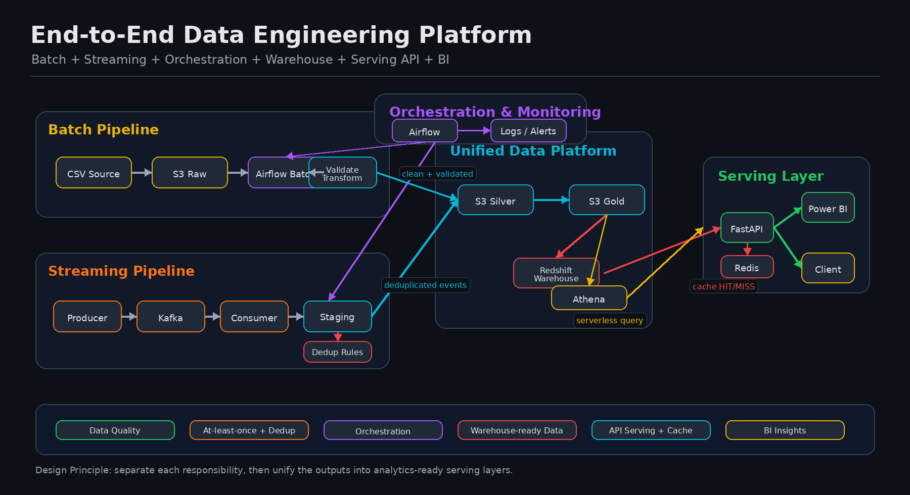

# 🚀 End-to-End Data Engineering Platform

> A production-style data platform that simulates how modern companies build scalable data systems — from ingestion to real-time analytics and API serving.

👉 Batch + Streaming + Orchestration + Warehouse + Serving + BI — unified into one system

---

💡 This is not just a collection of pipelines.  
It is a **complete data platform designed with production architecture principles.**

---

## 🧱 Platform Layers


---

## ⚙️ Engineering Concepts


---

### 🎯 Platform Goal

Build a unified data engineering platform that connects:

**Raw Data + Real-time Events → Processing → Warehouse → API Serving → Business Insights**

---

## 📌 Summary

This project is a **production-style end-to-end data engineering platform** that demonstrates how modern systems handle both batch and real-time data.

Instead of building isolated components, this platform integrates:

- Batch ETL pipeline (data ingestion → transformation → modeling)
- Real-time streaming pipeline (Kafka + event processing)
- Workflow orchestration (Airflow)
- Data warehouse (Redshift)
- Serving layer (FastAPI + Redis caching)
- BI consumption (Power BI)

👉 The goal is not just to move data — but to **serve reliable, scalable, and business-ready insights**

---

## 🧠 What Makes This Different

Unlike typical data projects that focus on isolated tools, this platform:

- Integrates **batch and streaming pipelines into one unified system**
- Implements **real-world architecture patterns (Kafka, Airflow, Warehouse, API)**
- Demonstrates **production concerns (caching, retries, deduplication, observability)**
- Serves data through a **dedicated API layer**, not directly from ETL

👉 This reflects how modern data platforms are built in real-world environments

---

## 🏗 System Architecture (Production-Style Data Platform)

This project demonstrates how modern data platforms are built in real-world environments by integrating:

👉 Batch Processing + Real-time Streaming + Orchestration + Serving Layer

All pipelines are unified into a single analytics-ready data model, enabling scalable, reliable, and production-ready data workflows.



---

### 💡 Key Design Principles

- Separation of concerns across batch, streaming, and serving layers
- At-least-once processing with downstream deduplication strategy
- Unified data model for both real-time and batch analytics
- Orchestrated pipelines with Airflow for reliability and monitoring
- Production-ready serving layer with API + caching (Redis)

---

## 🔄 End-to-End Data Flow

### 1️⃣ Streaming Layer (Real-time)

* Kafka ingests real-time events
* Consumer processes:

  * Deduplication (Redis)
  * Aggregation
  * Anomaly detection
* Output stored in staging layer

---

### 2️⃣ Batch Processing Layer (ETL)

* Data validation & cleaning
* Transformation (Pandas)
* Data quality checks
* Build **Star Schema**
* Load into warehouse

---

### 3️⃣ Data Warehouse Layer

* Central analytics storage (Redshift)
* Stores:

  * Fact tables (sales)
  * Dimension tables (customer, product, region)
* Supports BI and API queries

---

### 4️⃣ Serving Layer (API)

* FastAPI provides analytics endpoints
* Redis caching (HIT / MISS)
* Used by:

  * Power BI
  * External clients

---

### 5️⃣ Orchestration Layer

* Airflow manages workflows
* Handles:

  * Scheduling
  * Retries
  * Monitoring
  * Failure handling

---

## 📦 Projects in This Platform

| Project       | Description                                |
| ------------- | ------------------------------------------ |
| **Project 1** | Batch ETL Pipeline (Data Foundation Layer) |
| **Project 2** | Analytics API (Serving Layer)              |
| **Project 3** | Kafka Streaming Pipeline                   |
| **Project 4** | Airflow Orchestration                      |
| **Project 5** | Cloud + Data Warehouse                     |

---

## 🔗 Repository Links

* 🟦 Batch ETL → https://github.com/Chu-Thana/superstore-etl-analytics
* 🟩 Analytics API → https://github.com/Chu-Thana/superstore-fastapi-analytics
* 🟧 Streaming (Kafka) → https://github.com/Chu-Thana/kafka-streaming-pipeline
* 🟪 Airflow → https://github.com/Chu-Thana/superstore-airflow-orchestration

---

## 🧪 Example Data Flow (Real-World Scenario)

This scenario demonstrates how data is served to end users in a production environment.

```text
User opens Power BI dashboard
→ Power BI sends request to FastAPI endpoint
→ API checks Redis cache

IF CACHE HIT:
    → Return response instantly ⚡ (~milliseconds)

IF CACHE MISS:
    → Query aggregated data from Redshift (warehouse)
    → Transform result into API response format
    → Store result in Redis (cache warm-up)
    → Return response to client
```

---

### ⚡ Performance Impact

* Cache HIT → **sub-second response time**
* Cache MISS → **heavy query handled by Redshift**
* Subsequent requests → served instantly from Redis

---

### 🧠 What This Demonstrates

* Real-world **cache-aside strategy (lazy loading)**
* Separation between **serving layer and warehouse**
* Optimized for both **performance and cost efficiency**

---

👉 This is how modern analytics systems deliver fast and scalable data to BI tools

---

## 🧠 Key Engineering Concepts

This platform demonstrates:

* ⚡ **Event-driven architecture** (Kafka-based streaming)
* 🔄 **Batch + Streaming hybrid system**
* 🧱 **Data modeling (Star Schema) for analytics**
* ♻️ **Idempotent processing for reliability**
* ⚡ **Cache-aside strategy (Redis) for performance optimization**
* 🌐 **API design with pagination (offset & cursor)**
* ⏱️ **Workflow orchestration (Airflow DAGs)**
* 📊 **Observability (structured logs + metrics)**
* 🛡️ **Fault tolerance & retry mechanisms**

---

👉 Designed to reflect how real-world data platforms are built and operated

👉 These concepts are applied across batch, streaming, and serving layers in this platform

---

## ⚙️ Design Principles

* 🧱 **Separation of concerns**
  Clear layering across ingestion, processing, storage, and serving

* 📈 **Scalability by design**
  Stateless API + Kafka partitions enable horizontal scaling

* 🛡️ **Reliability & data quality**
  Validation, retries, and idempotent processing ensure consistency

* ⚡ **Performance optimization**
  Redis caching reduces latency and warehouse load

* 🧩 **Modular & maintainable architecture**
  Each component is independently developed and extensible

---

👉 These principles guide how the platform is designed, built, and operated

---

## 🔍 Observability

Each layer of the platform is instrumented for monitoring and debugging:

* 🌐 **API Layer**
  Request logs, query latency (`query_ms`), cache status (HIT/MISS)

* 🧱 **Batch ETL**
  Validation reports, rejected records, transformation logs

* ⏱️ **Orchestration (Airflow)**
  DAG runs, task failures, retries, execution history

* ⚡ **Streaming Pipeline**
  Event processing logs, consumer activity, deduplication tracking

---

👉 Enables end-to-end visibility across the entire data pipeline

👉 Supports fast debugging, performance tuning, and reliability monitoring

---

## 🚀 Why This Project Stands Out

Most data engineering portfolios focus on:

* ❌ Isolated scripts
* ❌ Single-tool demonstrations
* ❌ Disconnected pipelines

---

### 👉 This project takes a different approach:

* 🧠 **Built as a complete data platform** — not individual projects
* 🔗 **End-to-end data flow** from ingestion → processing → warehouse → API → BI
* ⚙️ **Multiple systems integrated** (Kafka, Airflow, Redshift, FastAPI, Redis)
* 🏗️ **Production-style architecture patterns**
* 📊 **Designed for real-world data consumption (Power BI, APIs)**

---

💡 This is not just a collection of tools —
it reflects how modern data platforms are **designed, integrated, and operated in production**

---

## 🎯 Key Takeaway

Modern data systems do **NOT** serve data:

* ❌ Directly from databases
* ❌ Directly from ETL pipelines

---

👉 Instead, they deliver data through a **dedicated serving layer**:

* ⚡ **Scalable API layer** (FastAPI)
* 🗄️ Backed by a **data warehouse** (Redshift)
* 🚀 Optimized with **caching** (Redis)

---

💡 This architecture ensures:

* Fast and consistent data access
* Decoupling between data processing and data consumption
* Scalability for real-world applications

---

## 🔥 Final Thought

This is not just a collection of projects.

👉 It represents a **complete Data Engineering Platform** — designed with a production mindset.

---

### 🌍 End-to-End Data Flow

```text id="9q7o4e"
Raw Data + Real-time Events
→ Processing (Batch + Streaming)
→ Data Warehouse
→ API Serving Layer
→ Business Insights
```

---

💡 This reflects how modern data systems are built:

* Data is not just processed — it is **served**
* Systems are not isolated — they are **integrated**
* Pipelines are not scripts — they are **products**

---

🚀 This project demonstrates the ability to design and build **real-world data platforms end-to-end**

---

## 🚧 Future Improvements

This platform is designed with extensibility in mind. Planned enhancements include:

* 🔁 **CI/CD pipeline**
  Automate testing and deployment for production readiness

* ☁️ **Infrastructure as Code (Terraform)**
  Manage cloud resources in a scalable and reproducible way

* 📊 **Advanced Monitoring (Prometheus + Grafana)**
  Real-time metrics, alerting, and system observability

* ✅ **Data Quality Framework**
  Automated validation, anomaly detection, and data contracts

* 🚀 **Cloud-native deployment**
  Fully deploy pipelines and services on cloud infrastructure

---

👉 These improvements move the platform closer to a **fully production-grade data system**

---

## 👩‍💻 Author

Built with a focus on **real-world system design** — not just tools or isolated components.

---

💡 This project reflects a strong interest in:

* End-to-end data platform design
* Production-style architecture
* Scalable and maintainable data systems

---

🚀 If you're hiring for a **Data Engineer role**,
this repository demonstrates the kind of **system-level thinking and engineering approach** I bring.

