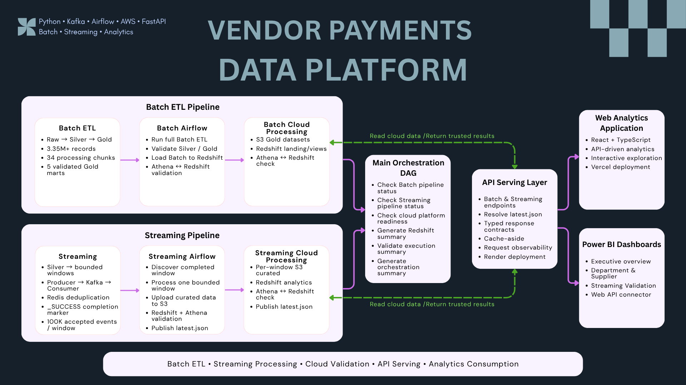

# Vendor Payments Data Platform


An end-to-end data engineering portfolio connecting Batch ETL, bounded-window Streaming, Airflow orchestration, AWS cloud analytics, FastAPI serving, Power BI, and a deployed React analytics application.

**Built independently by Thanaseth Chuachan, a Data Engineer candidate with a Mathematics background.**

[**Live Analytics Application**](https://vendor-payments-analytics.vercel.app) · [**FastAPI Documentation**](https://vendor-payments-api-render.onrender.com/docs) · [**Explore the Repositories**](#explore-the-repositories)

---

## Platform at a Glance

| Metric | Validated result |
| --- | ---: |
| Batch records processed | 3,354,965 |
| Batch processing chunks | 34 |
| Validated Gold marts | 5 |
| Streaming windows prepared | 3 |
| Accepted Streaming events per window | 100,000 |
| Duplicate events injected per window | 5,000 |
| Distinct Streaming event IDs in warehouse | 100,000 |
| Duplicate Streaming event IDs in warehouse | 0 |
| Missing Streaming event IDs in warehouse | 0 |
| Redshift analytics views | 9 |
| Batch cross-layer validation | PASS |
| Streaming cross-layer validation | PASS |
| Analytics dashboards | 3 |

> Metrics are based on full execution runs, generated metadata, cross-layer validation, automated tests, CI, and runtime evidence stored in the component repositories.

---

## Architecture



The current architecture keeps Batch and Streaming lifecycles independent while sharing cloud, serving, and analytics capabilities.

```text
Batch ETL
→ Batch Airflow
→ Batch Cloud Processing
→ S3 / Athena / Redshift
                     ↘
                      FastAPI
                     ↗
Streaming
→ Streaming Airflow
→ Streaming Cloud Processing
→ per-window S3 / Athena / Redshift
→ latest.json

Batch Pipeline DAG ───────┐
                          ├→ Main Orchestration DAG
Streaming Pipeline DAG ───┘
                          → status checks
                          → cloud readiness
                          → Redshift summary
                          → orchestration summary

FastAPI
├──→ React Web Analytics
└──→ Power BI Dashboards
```

### Responsibility Boundaries

- **Batch ETL Pipeline** owns Raw → Silver → Gold transformation, data-quality flags, Silver validation, Gold mart generation, and runtime metadata.
- **Streaming Pipeline** owns bounded-window preparation, Producer → Kafka → Consumer processing, Redis deduplication, per-window staging, `_SUCCESS` completion markers, and execution metrics.
- **Batch Pipeline DAG** runs the full Batch ETL lifecycle, validates outputs, uploads Gold data, loads Redshift, and performs Athena ↔ Redshift validation.
- **Streaming Pipeline DAG** discovers one completed bounded window, processes curated output, loads cloud analytics, validates Athena ↔ Redshift metrics, publishes `latest.json`, and marks the window processed.
- **Main Orchestration DAG** checks Batch and Streaming pipeline status, checks cloud readiness, generates Redshift execution metadata, validates the summary, and publishes orchestration metadata.
- **Cloud Data Platform** owns S3 publishing, Athena query assets, Redshift landing / analytics objects, cross-layer validation, runtime metadata, and the latest Streaming pointer.
- **API Serving Layer** exposes Batch and Streaming analytics through stable contracts and dynamically resolves the latest completed Streaming window.
- **React and Power BI** consume the FastAPI serving layer for interactive and business analytics.

---

## Batch ETL Pipeline

The Batch path processes the full Vendor Payments source through a validated Raw → Silver → Gold workflow.

```text
Raw
→ Data Readiness
→ Silver Transformation
→ Silver Validation
→ Gold Mart Build
→ Gold Validation
→ Runtime Metadata
```

Latest validated execution:

```text
Source rows         = 3,354,965
Silver rows         = 3,354,965
Chunks              = 34
Silver columns      = 49
Row-hash uniqueness = 100%
Gold marts          = 5 / 5 PASS
```

The validated Silver dataset is also the source used to prepare deterministic Streaming windows, while Batch and Streaming processing remain separate lifecycles.

---

## Bounded Streaming Pipeline

The Streaming path moved from one fixed input toward deterministic bounded windows:

```text
stream_window_001
stream_window_002
stream_window_003
```

Each window contains:

```text
100,000 source events
+ 5,000 replay / duplicate events
= 105,000 attempted Kafka messages
```

Validated producer / consumer behavior per window:

```text
Producer acknowledged = 105,000
Producer failed       = 0

Consumer consumed     = 105,000
Accepted events       = 100,000
Rejected duplicates   = 5,000
Failed events         = 0
```

The Consumer writes per-window staging output and creates `_SUCCESS` only after the expected accepted-event count is reached.

Airflow later creates `_PROCESSED` after downstream completion.

---

## Airflow Orchestration

The platform now uses three DAGs with separate responsibilities.

### Batch Pipeline DAG

```text
Run full Batch ETL
→ Validate Silver / Gold
→ Upload Gold to S3
→ Load Batch data to Redshift
→ Validate analytics
→ Athena ↔ Redshift cross-layer validation
```

### Streaming Pipeline DAG

```text
Discover _SUCCESS window
→ Ignore _PROCESSED windows
→ Process one bounded window
→ Upload curated output to S3
→ Load Redshift
→ Athena ↔ Redshift cross-layer validation
→ Publish latest.json
→ Create _PROCESSED
```

### Main Orchestration DAG

```text
Check Batch pipeline status
Check Streaming pipeline status
→ Check cloud readiness
→ Generate Redshift summary
→ Validate execution summary
→ Generate orchestration summary
```

The Main DAG does not rerun both pipelines. It verifies the latest successful independent states and summarizes platform readiness.

---

## AWS Cloud Data Platform

Batch and Streaming use the same AWS services without merging into one data lifecycle.

### Batch

```text
Validated Gold marts
→ Amazon S3
├──→ Amazon Athena
└──→ Amazon Redshift
        ↓
Athena ↔ Redshift validation
```

### Streaming

```text
Completed bounded window
→ per-window curated S3 output
├──→ Amazon Athena
└──→ Amazon Redshift
        ↓
Athena ↔ Redshift validation
        ↓
latest.json
```

Latest verified Streaming pointer:

```json
{
  "window_id": "stream_window_003",
  "status": "completed",
  "events_s3_key": "data-platform/vendor-payments/streaming/curated/stream_window_003/vendor_payments_streaming_events.csv"
}
```

Latest cross-layer results:

```text
Batch cross-layer validation     = PASS
Streaming cross-layer validation = PASS
```

The warehouse currently exposes **5 Batch analytics views + 4 Streaming analytics views = 9 Redshift analytics views**.

---

## FastAPI Serving Layer

The API provides a stable serving boundary over trusted cloud-backed datasets.

```text
Analytics Consumers
        ⇅
FastAPI Endpoint Layer
        ⇅
Cache Layer
        ⇅
Service Layer
        ⇅
Repository Layer
        ⇅
AWS S3
```

### Streaming Resolution

Streaming endpoints do not hard-code a specific window.

```text
latest.json
→ validate window_id
→ validate status = completed
→ resolve events_s3_key
→ load curated Streaming data
→ return API response
```

Latest Streaming Summary evidence:

```text
HTTP status        = 200
total_events       = 100,000
unique_departments = 74
unique_suppliers   = 12,282
fiscal-year range  = 2007–2026
```

### Cache Behavior

Local repeated-request evidence:

```text
Cache MISS
X-Cache-Status: MISS
X-Process-Time-MS: 173.92

Cache HIT
X-Cache-Status: HIT
X-Process-Time-MS: 0.8
```

The API is deployed to Render through:

```text
Ruff + Pytest
→ Docker Build
→ Deploy to Render
→ /health
→ Live API
```

---

## Live Web Analytics Application

**Live application:** https://vendor-payments-analytics.vercel.app  
**API documentation:** https://vendor-payments-api-render.onrender.com/docs

### Project Overview


### Executive Overview


### Department and Supplier Analysis


### Streaming and Validation


The React application demonstrates:

- API-driven analytics instead of embedded static datasets
- Batch fiscal-year KPIs and long-term trends
- Department, organization-group, and supplier analysis
- Streaming event analytics from the latest completed window
- Responsive application navigation
- Vercel deployment
- SPA deep-link routing support

---

## Power BI Dashboards

Three Power BI dashboards provide a second analytics-consumption path through the API.

### Executive Overview Dashboard


### Department and Supplier Dashboard


### Streaming and Validation Dashboard


This dual-consumption design allows React and Power BI to reuse the same serving layer without duplicating upstream ETL or Streaming logic.

---

## Explore the Repositories

| Repository | Responsibility | Engineering focus |
| --- | --- | --- |
| [**vendor-payments-etl-analytics**](https://github.com/Chu-Thana/vendor-payments-etl-analytics) | Batch ETL | Raw → Silver → Gold, chunk processing, deterministic keys, quality flags, validation, Gold marts |
| [**vendor-payments-streaming-pipeline**](https://github.com/Chu-Thana/vendor-payments-streaming-pipeline) | Kafka Streaming | bounded windows, Producer, Kafka, Consumer, Redis deduplication, staging, completion markers |
| [**vendor-payments-airflow-orchestration**](https://github.com/Chu-Thana/vendor-payments-airflow-orchestration) | Workflow orchestration | Batch DAG, Streaming DAG, Main Orchestration DAG, cross-layer execution control |
| [**vendor-payments-cloud-data-platform**](https://github.com/Chu-Thana/vendor-payments-cloud-data-platform) | AWS cloud analytics | S3, Athena, Redshift Serverless, cross-layer validation, runtime metadata, `latest.json` |
| [**vendor-payments-api-serving**](https://github.com/Chu-Thana/vendor-payments-api-serving) | API serving | FastAPI, repository/service layers, latest-window resolution, caching, Docker, Render |
| [**data-engineering-platform**](https://github.com/Chu-Thana/data-engineering-platform) | Final analytics platform | React + TypeScript web analytics, Power BI, integrated architecture and portfolio documentation |

---

## End-to-End Data Flow

```text
Vendor Payments source
│
├── Batch
│   └── Raw → Silver → Gold
│       → Batch Pipeline DAG
│       → S3 / Athena / Redshift
│
└── Streaming
    └── Silver → bounded windows
        → Producer → Kafka → Consumer
        → Redis deduplication
        → _SUCCESS
        → Streaming Pipeline DAG
        → per-window S3 / Athena / Redshift
        → cross-layer validation
        → latest.json

Batch Pipeline DAG ───────┐
                          ├→ Main Orchestration DAG
Streaming Pipeline DAG ───┘

Trusted cloud outputs
→ FastAPI
├──→ React Web Analytics
└──→ Power BI
```

---

## Selected Engineering Results

### Batch

- Processed **3,354,965 records**
- Preserved **3,354,965 Silver rows**
- Processed data in **34 chunks**
- Validated **49 Silver columns**
- Achieved **100% source-row-hash uniqueness**
- Produced **5 validated Gold marts**
- Passed **20 automated tests** and Ruff validation

### Streaming

- Prepared **3 deterministic bounded windows**
- Produced **100,000 accepted events per window**
- Injected and rejected **5,000 replay duplicates per window**
- Used Producer delivery acknowledgement tracking
- Used Consumer manual offset commits
- Used Redis TTL deduplication
- Added per-window staging, `_SUCCESS`, and `_PROCESSED`
- Passed **51 automated tests** and Ruff validation

### Airflow

- Split Batch and Streaming into independent pipeline DAGs
- Added a Main Orchestration DAG for status and platform summaries
- Added Batch and Streaming Athena ↔ Redshift validation
- Published `latest.json` only after Streaming validation
- Passed **17 container-based automated tests** and Ruff validation

### Cloud

- Published trusted Batch Gold and per-window Streaming outputs to S3
- Added Athena as an independent S3 validation layer
- Loaded **5 Batch landing tables** and **1 Streaming landing table**
- Created **9 Redshift analytics views**
- Validated **0 duplicate** and **0 missing** Streaming event IDs in the warehouse
- Passed **34 automated tests** and Ruff validation

### API

- Exposed Batch and Streaming analytics through FastAPI
- Dynamically resolves the latest completed Streaming window
- Uses typed response contracts, middleware observability, and cache-aside behavior
- Passed **57 automated tests**
- CI/CD validates Ruff, Pytest, Docker build, and Render deployment

### Analytics

- Delivered React + TypeScript web analytics
- Delivered **3 Power BI dashboards**
- Connected both analytics paths to reusable API-backed data
- Deployed the React application to Vercel

---

## Engineering Decisions

The platform is designed around clear responsibility boundaries and independently validated interfaces.

- **Raw / Silver / Gold layering** separates source preservation, validated row-level data, and analytics-ready outputs.
- **Bounded Streaming windows** give Airflow deterministic downstream processing units without pretending continuous Kafka ingestion is a Batch DAG.
- **Producer delivery acknowledgement + Consumer manual commits** make delivery state explicit.
- **Redis deduplication** handles replayed events while preserving at-least-once delivery behavior.
- **Independent Batch and Streaming DAGs** avoid forcing workloads with different lifecycles into one execution path.
- **Athena ↔ Redshift reconciliation** verifies Data Lake and warehouse consistency instead of assuming a successful load proves correctness.
- **`latest.json`** provides an explicit serving contract for the latest completed Streaming window.
- **Layered FastAPI architecture** separates routing, caching, service logic, and storage access.
- **Reusable API contracts** allow React and Power BI to consume the same trusted analytics layer.
- **Evidence-based delivery** connects architecture claims to runtime metadata, tests, CI, and screenshots.

---

## Technology Stack

| Layer | Technologies |
| --- | --- |
| Data processing | Python, Pandas, SQL |
| Streaming | Apache Kafka, Redis |
| Orchestration | Apache Airflow |
| Cloud storage / query | Amazon S3, Amazon Athena |
| Warehouse | Amazon Redshift Serverless |
| API serving | FastAPI, Pydantic, Uvicorn, in-memory caching |
| Business intelligence | Power BI |
| Web analytics | React, TypeScript, Vite, Recharts |
| Deployment | Render, Vercel, Docker, Docker Compose |
| Quality | Pytest, Ruff, GitHub Actions |

---

## Validation and CI/CD

Automated validation is implemented across the component repositories.

| Project | Current validation |
| --- | --- |
| Batch ETL | 20 tests + Ruff + GitHub Actions |
| Streaming | 51 tests + Ruff + GitHub Actions |
| Airflow | 17 container tests + Ruff + GitHub Actions |
| Cloud Platform | 34 tests + Ruff + GitHub Actions |
| API Serving | 57 tests + Ruff + Docker build + Render deployment |
| Analytics | React production build + deployed API-driven application |

Cross-layer runtime validation additionally verifies:

```text
Batch S3 / Athena ↔ Redshift      PASS
Streaming S3 / Athena ↔ Redshift PASS
```

---

## Repository Structure

```text
data-engineering-platform/
│
├── assets/
│   ├── 00_vendor_payments_data_platform_overview.png
│   ├── dashboards/
│   │   ├── 01_executive-overview-dashboard.png
│   │   ├── 02_department-supplier-dashboard.png
│   │   └── 03_streaming-validation-dashboard.png
│   └── web-analytics/
│       ├── 01_project-overview.png
│       ├── 02_executive-overview.png
│       ├── 03_department-supplier-analysis.png
│       └── 04_streaming-validation.png
│
├── powerbi/
│   └── vendor_payments_analytics.pbix
│
├── web/
│   └── vendor-payments-analytics/
│       ├── public/
│       ├── src/
│       ├── package.json
│       ├── vercel.json
│       └── vite.config.ts
│
└── README.md
```

The implementation details remain in dedicated component repositories. This repository presents the integrated architecture and final analytics-consumption layer.

---

## Run the Web Application Locally

### Start FastAPI

```powershell
cd E:\\dev\\vendor-payments-api-serving
.\\.venv\\Scripts\\Activate.ps1
python -m uvicorn app.main:app --reload
```

### Start React

```powershell
cd E:\\dev\\data-engineering-platform\\web\\vendor-payments-analytics
npm install
npm run dev
```

Local services:

```text
FastAPI: http://127.0.0.1:8000
Swagger: http://127.0.0.1:8000/docs
React:   http://localhost:5173
```

Frontend environment:

```env
VITE_API_BASE_URL=http://localhost:8000
```

Do not commit local `.env` files or secrets.

---

## Deployment

```text
React Web Analytics
https://vendor-payments-analytics.vercel.app

FastAPI Documentation
https://vendor-payments-api-render.onrender.com/docs
```

The frontend is deployed through Vercel and uses `VITE_API_BASE_URL` for the public API. SPA routes are rewritten to `index.html` so deep links and browser refreshes work correctly.

The API is containerized and deployed to Render through a GitHub Actions gated deployment path.

---

## What This Portfolio Demonstrates

This project follows the data lifecycle beyond transformation alone:

```text
Data ingestion
→ Batch and Streaming processing
→ Validation and deduplication
→ Independent orchestration lifecycles
→ Cloud storage and warehouse analytics
→ Cross-layer reconciliation
→ API serving
→ React and Power BI consumption
```

It demonstrates data pipeline development, system design, data quality, reliability trade-offs, orchestration, cloud analytics, API contracts, deployment, testing, and downstream consumption as one connected platform.

---

## Key Takeaway

This is not a collection of disconnected tool demos.

It is a modular data platform in which each component owns a clear responsibility, publishes validated outputs, and contributes to a deployed analytics experience that can be reviewed end to end.

```text
Batch ETL
+
Bounded Streaming
+
Airflow Orchestration
+
AWS S3 / Athena / Redshift
+
FastAPI
+
React / Power BI
=
Vendor Payments Data Platform
```
