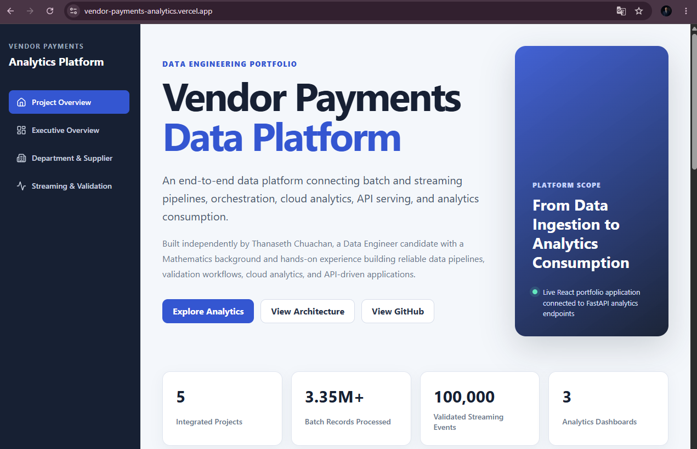
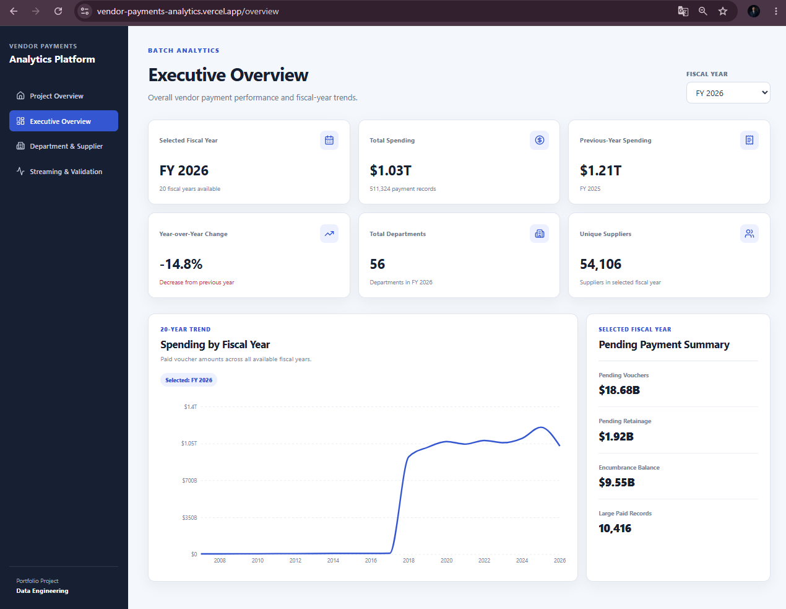
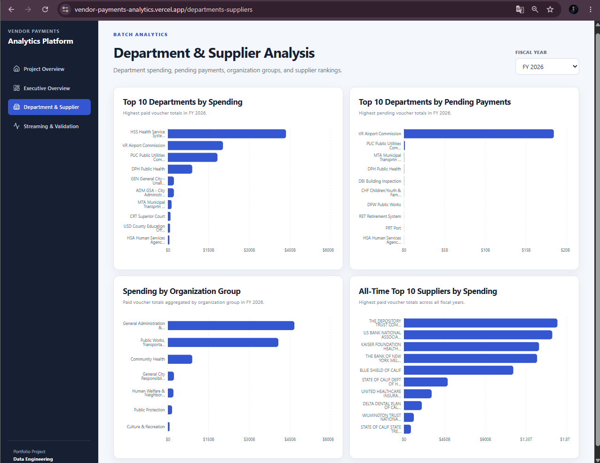
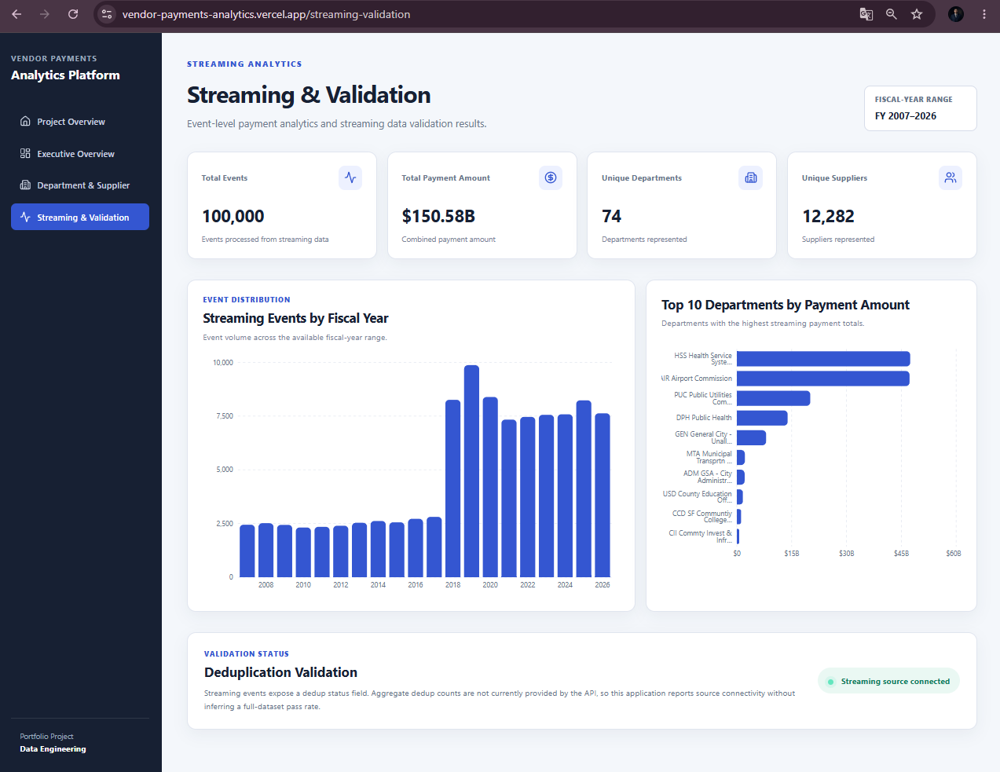
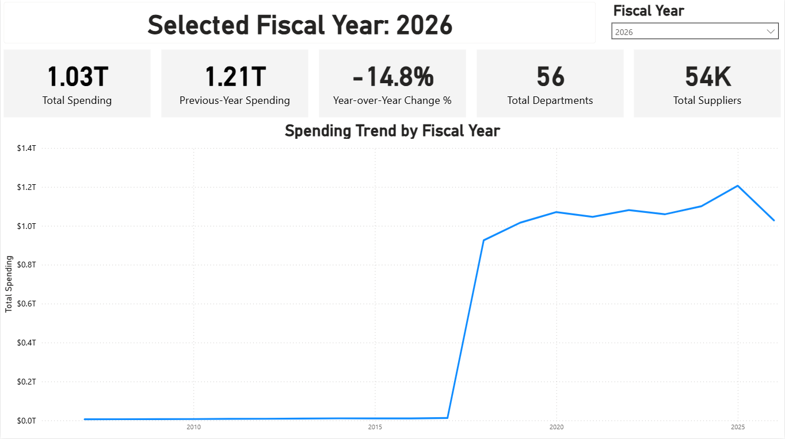
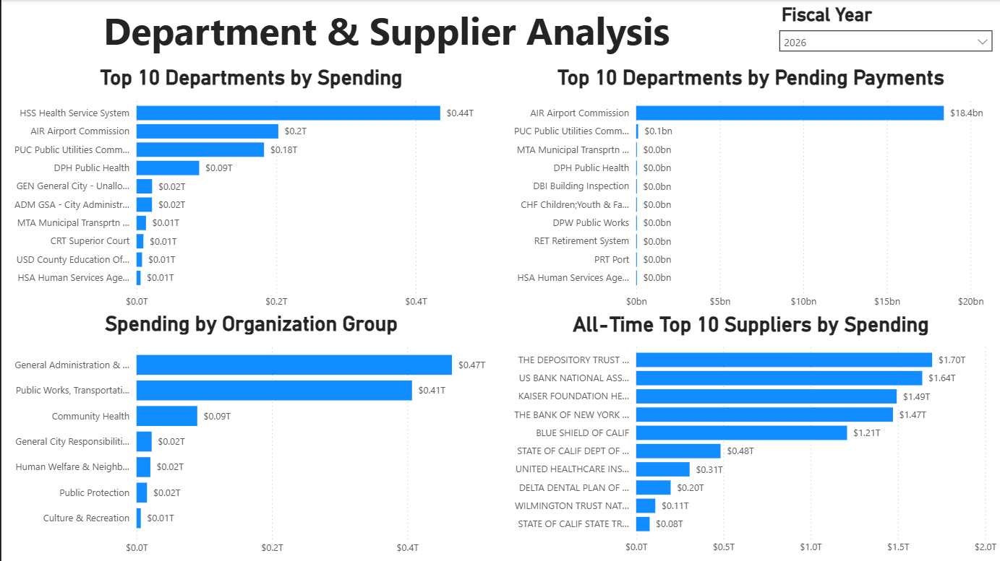
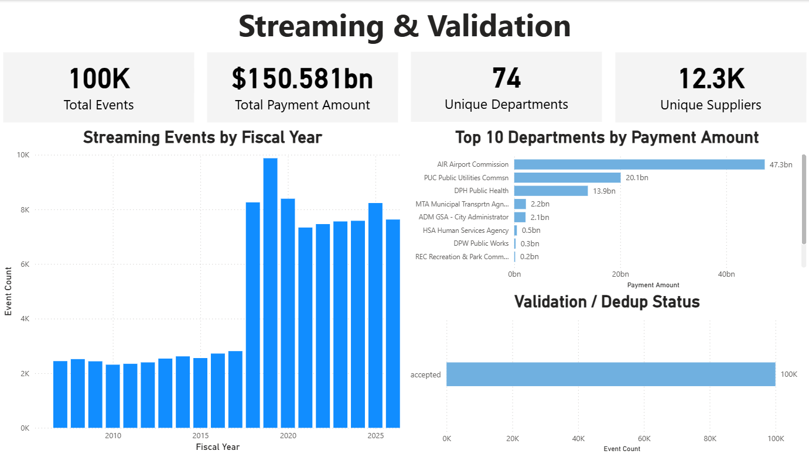

# Vendor Payments Data Platform


An end-to-end data engineering portfolio that connects Batch ETL, Streaming, Airflow orchestration, AWS analytics, FastAPI serving, Power BI, and a deployed React analytics application.

**Built independently by Thanaseth Chuachan, a Data Engineer candidate with a Mathematics background.**

[**Live Analytics Application**](https://vendor-payments-analytics.vercel.app) · [**FastAPI Documentation**](https://vendor-payments-api-render.onrender.com/docs) · [**Explore the Repositories**](#explore-the-repositories)

---

## Platform at a Glance

| Metric | Validated result |
|---|---:|
| Platform repositories / components | 6 |
| Batch records processed | 3.35M+ |
| Validated Streaming events | 100,000 |
| Distinct Streaming event IDs | 100,000 |
| Duplicate or missing event IDs in warehouse validation | 0 |
| Main Airflow workflow | 25 tasks |
| Main Airflow workflow runtime | 1,160.74 seconds |
| API cache validation | Cache MISS 7,076.46 ms → Cache HIT 0.58 ms |
| Cached response improvement | ~12,200× faster with 99.99% latency reduction |
| Total Redshift analytics views | 9 |
| Analytics dashboards delivered | 3 |

> Metrics are based on project validation runs, generated metadata, automated tests, and execution evidence stored in the individual repositories.

---

## Architecture


The platform separates processing responsibilities while keeping the complete delivery path traceable:

```text
                         Apache Airflow
                    orchestrates & validates
                         ⋮             ⋮
                         ↓             ↓

Batch ETL + Kafka Streaming ─────→ Cloud Data Platform
                                      │
                                      ↓
                               FastAPI Serving
                                  ↙         ↘
                           Power BI        React Web
```

### Responsibility Boundaries

- **Batch ETL Pipeline** owns Raw → Silver → Gold transformation, validation, and analytics marts.
- **Kafka Streaming Pipeline** owns Producer → Kafka → Consumer processing, schema validation, Redis-backed deduplication, accepted-event staging, and execution metrics.
- **Airflow Orchestration** owns execution order, dependency coordination, Batch execution, downstream Streaming validation, JSONL → CSV conversion, S3/Redshift orchestration, and execution summaries.
- **Cloud Data Platform** owns S3 publishing, Athena definitions, Redshift loading, analytics views, and runtime metadata.
- **API Serving Layer** exposes validated Batch and Streaming analytics through reusable contracts.
- **Power BI and React** consume the FastAPI serving layer for business reporting and interactive exploration.

---

## Live Web Analytics Application

The deployed React application consumes the public FastAPI service and presents the final analytics consumption layer of the platform.

**Live application:** https://vendor-payments-analytics.vercel.app  
**API documentation:** https://vendor-payments-api-render.onrender.com/docs

### Project Overview



### Executive Overview



### Department and Supplier Analysis



### Streaming and Validation



The application demonstrates:

- Reusable API-driven analytics rather than embedded static data
- Batch fiscal-year analysis and executive KPIs
- Department, organization-group, and supplier rankings
- Streaming event distribution and source-validation status
- Responsive desktop and mobile layouts
- Public deployment through Vercel with a Render-hosted FastAPI backend

---

## Power BI Dashboards

Three Power BI dashboards provide a second analytics-consumption path through the Web API connector.

### Executive Overview Dashboard



### Department and Supplier Dashboard



### Streaming and Validation Dashboard



This dual-consumption design demonstrates that the platform can serve both conventional business intelligence and a reusable web application without duplicating upstream processing logic.

---

## Explore the Repositories

Each repository owns a focused platform responsibility and includes architecture documentation, implementation details, automated validation, runtime metadata, and execution evidence.

| Repository | Responsibility | Engineering focus |
|---|---|---|
| [**vendor-payments-etl-analytics**](https://github.com/Chu-Thana/vendor-payments-etl-analytics) | Batch ETL and analytics processing | Raw → Silver → Gold, chunk processing, deterministic keys, quality flags, validation, Gold marts |
| [**vendor-payments-streaming-pipeline**](https://github.com/Chu-Thana/vendor-payments-streaming-pipeline) | Kafka event processing | Producer, Kafka topic, Consumer, Redis deduplication, staging JSONL, alerts, execution metrics |
| [**vendor-payments-airflow-orchestration**](https://github.com/Chu-Thana/vendor-payments-airflow-orchestration) | Workflow orchestration | DAG dependencies, Batch execution, Streaming downstream validation, S3/Redshift orchestration, summaries |
| [**vendor-payments-cloud-data-platform**](https://github.com/Chu-Thana/vendor-payments-cloud-data-platform) | Cloud and warehouse analytics | Amazon S3, Athena, Redshift Serverless, landing tables, analytics views, warehouse validation |
| [**vendor-payments-api-serving**](https://github.com/Chu-Thana/vendor-payments-api-serving) | FastAPI analytics service | Typed contracts, service/repository layers, middleware, cache-aside responses, Docker, Render deployment |
| [**vendor-payments-analytics**](https://github.com/Chu-Thana/vendor-payments-analytics) | Analytics consumption | React + TypeScript web analytics, Power BI, reusable API-driven views |

---

## End-to-End Data Flow

```text
Vendor payment source data
│
├── Batch path
│   └── Raw → Silver → Gold → analytics marts
│
└── Streaming path
    └── Producer → Kafka → Consumer
        → validation → Redis deduplication
        → validated staging JSONL

Apache Airflow
→ runs and validates Batch processing
→ validates Streaming staging outputs
→ converts Streaming JSONL → curated CSV
→ coordinates S3 publishing and Redshift processing

Amazon S3
├──→ Amazon Athena
│    └── direct serverless SQL over curated S3 datasets
│
└──→ Amazon Redshift Serverless
     └── landing tables → analytics views → warehouse validation

Trusted analytics
→ FastAPI contracts
├──→ Power BI dashboards
└──→ React web analytics
```

The design keeps transformation, orchestration, cloud processing, serving, and presentation in separate modules with explicit interfaces between them.

---

## Selected Engineering Results

### Batch Processing

- Processed **3.35M+ vendor payment records**
- Applied Raw → Silver → Gold data layering
- Produced business-ready fiscal-year, department, supplier, pending-payment, and fund-category marts
- Added validation checkpoints and generated execution metadata
- Passed **20 automated tests** with Ruff validation

### Streaming Processing

- Accepted and validated **100,000 unique payment events**
- Preserved **100,000 distinct event IDs** after cloud and warehouse loading
- Validated **0 duplicate** and **0 missing event IDs** in Redshift
- Produced validated staging JSONL for downstream orchestration
- Passed **47 automated tests** with Ruff validation and CI

### API Serving

- Exposed Batch and Streaming analytics through FastAPI
- Applied Pydantic response contracts and layered service/repository design
- Reduced repeated Streaming Summary response time from **7,076.46 ms to 0.58 ms** through cache-aside caching—approximately **12,200× faster**
- Passed **57 automated tests** after deployment-summary integration
- Deployed publicly on Render and connected to the Vercel application

### Cloud Analytics

- Published trusted Batch and Streaming outputs to Amazon S3
- Queried curated S3 data through Amazon Athena
- Loaded **5 Batch landing tables** and **1 Streaming landing table** into Redshift Serverless
- Created **9 analytics views** across Batch and Streaming workloads
- Generated and validated machine-readable Redshift runtime metadata
- Passed **34 automated tests** with Ruff validation and CI

### Orchestration and Quality

- Coordinated the main platform workflow through **25 Airflow tasks**
- Applied Ruff, pytest, GitHub Actions, Docker, and Docker Compose across the portfolio
- Kept generated data, secrets, and local runtime files outside source control
- Stored execution evidence alongside the component that owns each responsibility

---

## Engineering Decisions

The portfolio is designed around practical data-engineering patterns rather than isolated tool demonstrations.

- **Layered data modeling** separates source data, validated data, and analytics-ready outputs.
- **Clear ownership boundaries** prevent Airflow, the API, and the warehouse from duplicating transformation logic.
- **At-least-once processing with deduplication** balances delivery reliability and record correctness.
- **Cache-aside serving** improves repeated analytics-request performance without changing API contracts.
- **Landing and analytics schemas** separate warehouse ingestion from downstream consumption.
- **Runtime metadata contracts** make execution state and validation results machine-readable.
- **Reusable serving contracts** allow Power BI and React to consume the same analytics layer.
- **Evidence-based delivery** connects architecture claims to tests, CI, metadata, and execution screenshots.

---

## Technology Stack

| Layer | Technologies |
|---|---|
| Data processing | Python, Pandas, SQL |
| Streaming | Apache Kafka, Redis |
| Orchestration | Apache Airflow |
| Cloud storage and query | Amazon S3, Amazon Athena |
| Warehouse | Amazon Redshift Serverless |
| API serving | FastAPI, Pydantic, in-memory caching, Uvicorn |
| Business intelligence | Power BI |
| Web analytics | React, TypeScript, Vite, Recharts |
| Deployment | Render, Vercel, Docker, Docker Compose |
| Quality | Pytest, Ruff, GitHub Actions |

---

## Validation and CI/CD

Automated validation is implemented across the platform repositories.

| Project | Automated validation |
|---|---|
| Batch ETL | Input readiness, pipeline execution, generated-output validation, pytest, Ruff, GitHub Actions |
| API Serving | Endpoint contracts, cache behavior, middleware, Batch and Streaming responses, Ruff, pytest |
| Streaming | Project structure, event processing, output validation, Docker Compose configuration |
| Airflow | DAG imports, project structure, cross-project metadata, orchestration outputs |
| Cloud Platform | S3 plans, Athena SQL assets, Redshift metrics, event-ID integrity, metadata contracts, CI |
| Analytics | Frontend build and API-driven analytics consumption |

The validation strategy is designed to detect broken code, missing assets, invalid metadata, incompatible response contracts, and deployment regressions before downstream consumption.

---

## Repository Structure

```text
data-engineering-platform/
│
├── assets/
│   ├── 00_vendor-payments-data-platform-overview.png
│   ├── dashboards/
│   │   ├── 01_executive-overview-dashboard.png
│   │   ├── 02_department-supplier-dashboard.png
│   │   └── 03_streaming-validation-dashboard.png
│   └── web-analytics/
│       ├── 01_project-overview.png
│       ├── 02_executive-overview.png
│       ├── 03_department-supplier-analysis.png
│       └── 04_streaming-validation.png
│
├── powerbi/
│   └── vendor_payments_analytics.pbix
│
├── web/
│   └── vendor-payments-analytics/
│       ├── public/
│       ├── src/
│       ├── package.json
│       └── vite.config.ts
│
└── README.md
```

The core component implementations remain in their dedicated repositories, while this repository presents the integrated architecture and final analytics-consumption layer.

---

## Run the Web Application Locally

### Start the FastAPI backend

```powershell
cd E:\dev\vendor-payments-api-serving
.\.venv\Scripts\Activate.ps1
python -m uvicorn app.main:app --reload
```

### Start the React frontend

```powershell
cd E:\dev\data-engineering-platform\web\vendor-payments-analytics
npm install
npm run dev
```

Local services:

```text
FastAPI: http://127.0.0.1:8000
Swagger: http://127.0.0.1:8000/docs
React:   http://localhost:5173
```

### Frontend environment configuration

```env
VITE_API_BASE_URL=http://localhost:8000
```

Do not commit local `.env` files or secrets.

---

## Deployment

### Public services

```text
Web application
https://vendor-payments-analytics.vercel.app

FastAPI documentation
https://vendor-payments-api-render.onrender.com/docs
```

The frontend is deployed through Vercel and reads the public API base URL from `VITE_API_BASE_URL`. The backend is containerized and deployed through Render with explicit CORS configuration for local development and the production Vercel origin.

The Render free instance may require a short cold start after inactivity before the first API-backed page finishes loading.

---

## What This Portfolio Demonstrates

Many portfolio projects stop after producing a dataset or exposing an endpoint. This platform continues through the complete analytics-delivery workflow:

```text
Data ingestion
→ Processing and validation
→ Orchestration
→ Cloud storage and warehouse analytics
→ API serving
→ Power BI and Web consumption
```

The result demonstrates data pipeline development, system design, data quality, performance optimization, cloud analytics, API contracts, deployment, documentation, and downstream consumption as parts of one connected platform.

---

## Key Takeaway

This is not a collection of disconnected tool demos.

It is a modular data platform in which each project owns a clear responsibility, publishes validated outputs, and contributes to a deployed analytics experience that can be opened and reviewed end to end.

