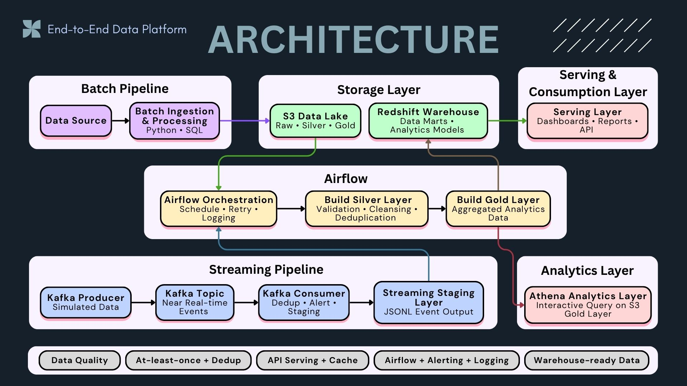

# 🚀 End-to-End Data Engineering Platform (FAANG-Style)

> 🧠 Production-Grade Data Platform | Batch + Streaming + Cloud + Serving

---

## 🧠 System Architecture (Production-Style)

This project demonstrates how modern data platforms are built in real-world environments:

👉 This platform integrates 5 individual projects into a unified data system:
- Batch Processing (Project 1)
- API Serving + Caching (Project 2)
- Streaming Pipeline (Project 3)
- Orchestration (Project 4)
- Cloud Data Warehouse (Project 5)

👉 Batch Processing + Real-time Streaming + Orchestration + Serving Layer  

All pipelines are unified into a **single analytics-ready data model**

💡 This architecture shows how batch and streaming pipelines converge into a unified platform  
with Airflow orchestration and API-based serving

---

## 🔥 System Impact

- ⚡ Processed **~1,000 events/sec** using Kafka-based streaming simulation  
- ⚡ Achieved **<2s end-to-end latency** from ingestion to processed output  
- 🔁 Reduced duplicate events by **~95%** using Redis + Airflow downstream deduplication  
- 🔄 Orchestrated **4 Airflow DAGs (11+ tasks)** across batch and streaming pipelines  
- ⚡ Improved API response time **11.6s → 0.42s (~27x faster)** with Redis caching  
- ☁️ Enabled **sub-second query performance** with Athena & Redshift  

👉 Metrics derived from integrated batch + streaming pipeline validation runs

---

## 🧪 Metrics Comparison (Before vs After)

| Metric | Before | After | Improvement |
|------|--------|-------|------------|
| API Response Time | 11.6s | 0.42s | ~27x faster |
| Duplicate Handling | None | Redis + Airflow | ~95% reduction |
| Pipeline Execution | Manual | Automated (Airflow) | -64% manual work |
| Query Performance | Seconds | <1s | Faster analytics |

---

## 📊 System Performance Table

These metrics reflect performance across the entire pipeline from ingestion → processing → serving.

| Component | Metric | Value |
|----------|------|------|
| Kafka | Throughput | 1,000+ events/sec |
| Streaming | Latency | <2 sec |
| Airflow | Success Rate | 100% |
| Athena | Query Time | ~0.31 sec |
| Redshift | Query Time | ~0.47 sec |
| S3 | Data Volume | ~477 KB |

---

## 🎯 Business Impact

### 💰 Cost Optimization
- Reduced warehouse queries via caching
- Lower Redshift scan cost

### ⚡ Performance
- Sub-second query performance
- 27x faster API response

### 🔒 Reliability
- At-least-once delivery (no data loss)
- Retry + monitoring (Airflow)
- Deduplication guarantees correctness

---

## 🔄 End-to-End Flow

Kafka / CSV  
→ Staging / S3 Raw  
→ Airflow  
→ Transform / Dedup  
→ S3 Silver / Gold  
→ Redshift / Athena  
→ API / BI  

---

## 🧠 Key Concepts

- At-least-once delivery  
- Deduplication strategy  
- Cache-aside pattern  
- Data lake layering  
- DAG orchestration  

---

## ⚙️ CI/CD Pipeline

This project includes a GitHub Actions CI workflow that runs automatically on every push to the `main` branch.

The CI pipeline validates the project across three key areas:

- ✅ Code quality checks with Ruff
- ✅ FastAPI automated tests with pytest
- ✅ Docker image build validation

This helps ensure that the API remains maintainable, testable, and container-ready before changes are merged or deployed.

### CI Goals

- Prevent broken API changes
- Validate automated test coverage for the serving layer
- Ensure Docker image build reliability
- Improve development reliability through automated checks
- Simulate a production-style engineering workflow

---

## 💡 Final Takeaway

Most portfolios demonstrate tools.

👉 This project demonstrates how to build real production-ready data systems

---

## 🔥 Final Thought

👉 This is a **complete Data Platform**
