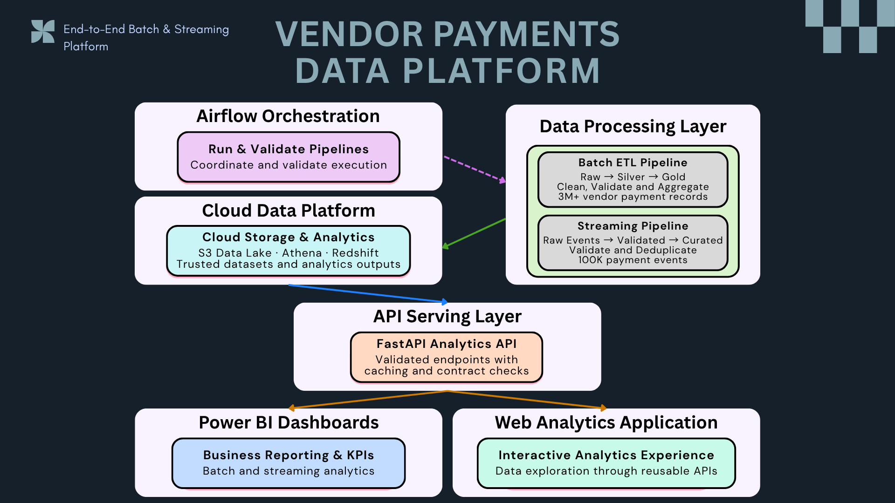

# Vendor Payments Data Platform

> An end-to-end data engineering portfolio that connects batch ETL, real-time streaming, Airflow orchestration, AWS analytics, FastAPI serving, Power BI, and a reusable web analytics layer.


## Platform at a Glance

This portfolio demonstrates how separate data engineering components can be designed as one connected analytics platform:

- **3M+ vendor payment records** processed through a Raw → Silver → Gold batch pipeline
- **100K payment events** validated and deduplicated through a streaming pipeline
- **4 Airflow DAGs with 11+ tasks** coordinating batch, streaming, validation, and downstream workflows
- **FastAPI analytics endpoints** accelerated from **11.6s to 0.42s** with cache-aside caching
- **AWS analytics layer** using S3, Athena, and Redshift for trusted downstream datasets
- **Consumption-ready design** for Power BI dashboards and a web analytics application

## System Overview



The platform separates orchestration, processing, cloud analytics, serving, and consumption while keeping the complete data flow easy to trace:

```text
Airflow Orchestration
        ↓
Batch ETL + Streaming Processing
        ↓
S3 Data Lake + Athena + Redshift
        ↓
FastAPI Analytics API
        ↓
Power BI Dashboards + Web Analytics Application
```

## Selected Engineering Results

| Area | Validated result |
|---|---:|
| Batch processing | 3M+ vendor payment records |
| Streaming processing | 100K payment events |
| Streaming throughput | ~1,000 events/sec |
| End-to-end streaming latency | <2 seconds |
| API response time | 11.6s → 0.42s |
| API performance gain | ~27× faster |
| Airflow orchestration | 4 DAGs, 11+ tasks |
| Athena query time | ~0.31 seconds |
| Redshift query time | ~0.47 seconds |

> Results are based on project validation runs and execution evidence included in the individual repositories.

## Explore the Projects

Each repository focuses on one part of the platform and includes architecture documentation, implementation details, tests, metadata, and execution evidence.

| Project | Focus | What it demonstrates |
|---|---|---|
| **Project 1 — Batch ETL Pipeline** | Raw → Silver → Gold processing | Data cleaning, validation, aggregation, analytics marts, and quality checks |
| **Project 2 — API Serving Layer** | FastAPI + Redis caching | Service-layer design, validated API contracts, middleware, caching, and performance testing |
| **Project 3 — Streaming Pipeline** | Kafka-style event processing | Event validation, deduplication, curated outputs, and streaming metrics |
| **Project 4 — Airflow Orchestration** | Workflow automation | DAG design, dependencies, retries, validation tasks, and operational metadata |
| **Project 5 — Cloud Data Platform** | AWS S3, Athena, and Redshift | Cloud storage, warehouse loading, analytics queries, CI validation, and trusted outputs |

<!-- Replace the project names above with direct repository links when publishing the profile README. -->

## Engineering Decisions

The platform is designed around practical data engineering patterns rather than isolated tool demonstrations:

- **Layered data modeling:** Raw, Silver, and Gold datasets separate ingestion, validation, and business-ready outputs.
- **At-least-once processing:** delivery reliability is paired with deduplication to preserve correctness.
- **Cache-aside API design:** repeated analytics requests are served quickly without unnecessary warehouse queries.
- **Workflow orchestration:** Airflow coordinates execution, validation, retries, and downstream dependencies.
- **Contract-driven serving:** response models and tests keep analytics endpoints predictable for consumers.
- **Evidence-based delivery:** each project includes execution screenshots, generated metadata, tests, and CI validation.

## Why This Portfolio Matters

Many portfolios show individual tools. This one shows how those tools work together as a maintainable data platform:

```text
Data Processing → Orchestration → Cloud Analytics → API Serving → Business Consumption
```

The result is a portfolio that demonstrates not only pipeline development, but also system design, data quality, performance optimization, observability, documentation, and downstream analytics readiness.

## Technology Stack

**Data processing:** Python, Pandas, SQL  
**Streaming:** Kafka-style producer and consumer workflows  
**Orchestration:** Apache Airflow  
**Cloud analytics:** AWS S3, Athena, Redshift  
**Serving:** FastAPI, Pydantic, Redis  
**Quality:** Pytest, validation scripts, CI workflows  
**Consumption:** Power BI and Web Analytics Application

---

### Current Direction

The next phase extends the trusted analytics datasets and FastAPI endpoints into:

- Power BI dashboards for business reporting and KPI monitoring
- A web analytics application built on the same reusable API layer

---

## ⚙️ Portfolio CI/CD Overview

This portfolio includes CI/CD practices across all 5 data engineering projects using GitHub Actions.

| Project | CI/CD Scope | Validation |
|---|---|---|
| Project 1: Vendor Payments Batch ETL | CI | Data readiness checks, raw → silver → gold pipeline, output validation, sample mode, unit/integration tests, Ruff lint, GitHub Actions CI |
| Project 2: FastAPI Serving Layer | CI/CD | Ruff lint, pytest, Docker build, GHCR publish, AWS EC2 deployment |
| Project 3: Kafka Streaming | CI | Ruff lint, project structure tests, Docker Compose config validation |
| Project 4: Airflow Orchestration | CI | Ruff lint, Airflow DAG import validation |
| Project 5: Cloud Warehouse Platform | CI | Ruff lint, cloud platform structure and asset validation |

👉 This demonstrates production-style engineering practices across batch processing, streaming, orchestration, API serving, and cloud warehouse layers.

---

## 🔥 System Impact

- ⚡ Processed **~1,000 events/sec** using Kafka-based streaming simulation  
- ⚡ Achieved **<2s end-to-end latency** from ingestion to processed output  
- 🔁 Reduced duplicate events by **~95%** using Redis + Airflow downstream deduplication  
- 🔄 Orchestrated **4 Airflow DAGs (11+ tasks)** across batch and streaming pipelines  
- ⚡ Improved API response time **11.6s → 0.42s (~27x faster)** with Redis caching  
- ☁️ Enabled **sub-second query performance** with Athena & Redshift  

👉 Metrics derived from integrated batch + streaming pipeline validation runs

---

## 🧪 Metrics Comparison (Before vs After)

| Metric | Before | After | Improvement |
|------|--------|-------|------------|
| API Response Time | 11.6s | 0.42s | ~27x faster |
| Duplicate Handling | None | Redis + Airflow | ~95% reduction |
| Pipeline Execution | Manual | Automated (Airflow) | -64% manual work |
| Query Performance | Seconds | <1s | Faster analytics |

---

## 📊 System Performance Table

These metrics reflect performance across the entire pipeline from ingestion → processing → serving.

| Component | Metric | Value |
|----------|------|------|
| Kafka | Throughput | 1,000+ events/sec |
| Streaming | Latency | <2 sec |
| Airflow | Success Rate | 100% |
| Athena | Query Time | ~0.31 sec |
| Redshift | Query Time | ~0.47 sec |
| S3 | Data Volume | ~477 KB |

---

## 🎯 Business Impact

### 💰 Cost Optimization
- Reduced warehouse queries via caching
- Lower Redshift scan cost

### ⚡ Performance
- Sub-second query performance
- 27x faster API response

### 🔒 Reliability
- At-least-once delivery (no data loss)
- Retry + monitoring (Airflow)
- Deduplication guarantees correctness

---

## 🔄 End-to-End Flow

Kafka / CSV  
→ Staging / S3 Raw  
→ Airflow  
→ Transform / Dedup  
→ S3 Silver / Gold  
→ Redshift / Athena  
→ API / BI  

---

## 🧠 Key Concepts

- At-least-once delivery  
- Deduplication strategy  
- Cache-aside pattern  
- Data lake layering  
- DAG orchestration  

---

## ⚙️ CI/CD Engineering Practices

This platform applies CI/CD and automated validation across the portfolio to improve reliability, maintainability, and deployment readiness.

The workflows validate:

- Code quality with Ruff
- Automated tests with pytest
- Batch ETL execution and generated output validation
- Kafka streaming project structure and Docker Compose configuration
- Airflow DAG import validation to prevent broken scheduler workflows
- Docker image build and publishing to GitHub Container Registry
- FastAPI deployment on AWS EC2 using Docker Compose

### CI/CD Goals

- Prevent broken code from being merged
- Validate pipeline behavior before deployment
- Detect missing dependencies and DAG import errors early
- Ensure Docker-based services remain buildable and deployable
- Simulate production-style engineering workflows across the data platform

---

## 💡 Final Takeaway

Most portfolios demonstrate tools.

👉 This project demonstrates how to build real production-ready data systems

---

## 🔥 Final Thought

👉 This is a **complete Data Platform**

